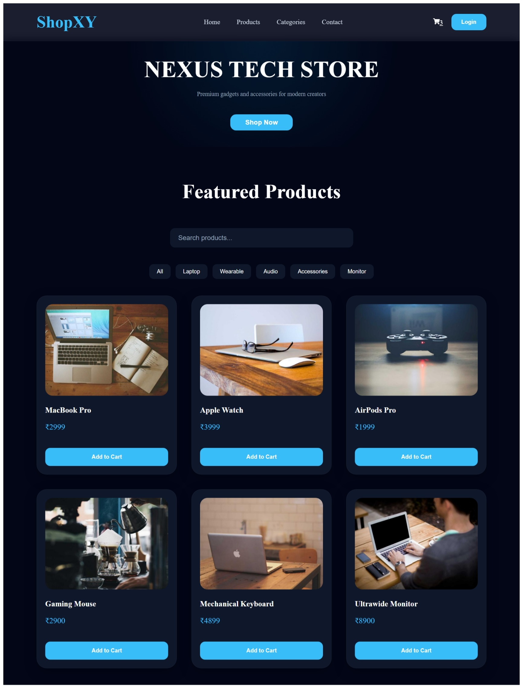
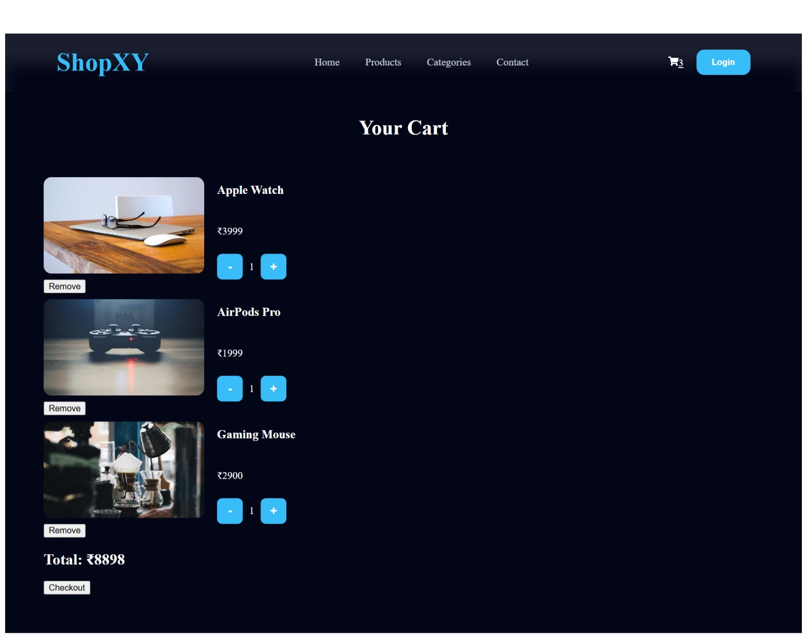

# 🛒 ShopXY - React Ecommerce Store

A modern Ecommerce Store built with React that allows users to browse products, search items, filter products by category, and manage a shopping cart with quantity controls.

---

## 🚀 Features

* Product listing page
* Product search functionality
* Category-based filtering
* Price sorting (Low → High / High → Low)
* Dynamic product details page using React Router
* Shopping cart management
* Product ratings and stock information
* Related products recommendations
* Responsive modern UI

### Product Catalog

* Display products in a responsive grid layout
* Reusable ProductCard component
* Product image, title, and price display

### Search Functionality

* Search products by name
* Instant filtering while typing

### Category Filtering

* Filter products by category
* Categories:

  * Laptop
  * Wearable
  * Audio
  * Accessories
  * Monitor

### Shopping Cart

* Add products to cart
* Increase product quantity
* Decrease product quantity
* Remove products from cart
* Automatic total price calculation

### Navigation

* React Router integration
* Home page
* Cart page

### User Interface

* Modern dark theme
* Responsive product grid
* Sticky navigation bar
* Hover animations
* Clean ecommerce layout

---

## 🛠️ Built With

* React
* React Router DOM
* JavaScript (ES6+)
* CSS3
* React Icons

---

## 📂 Project Structure

```text
src
│
├── components
│   ├── Hero.js
│   ├── Navbar.js
│   ├── ProductCard.js
│   └── ProductSection.js
│
├── pages
│   ├── Home.js
|   ├── Cart.js
│   └── ProductDetails.js
|   
├── data
|   └──products.js 
|
├── styles
│   └── global.css
│
├── App.js
└── index.js
```

---

## 📸 Current Features Preview

### Home Page

* Hero Section
* Featured Products
* Search Bar
* Category Filters



### Cart Page

* Product List
* Quantity Controls
* Remove Item
* Total Price Calculation



---

## 🔄 Current Development Progress

### Completed ✅

* React Router Setup
* Hero Section
* Product Listing
* Reusable Components
* Add To Cart
* Quantity Management
* Cart Total Calculation
* Product Search
* Category Filtering

### Upcoming Features 🚧

* Product Sorting
* Product Details Page
* Context API
* Local Storage Persistence
* Wishlist
* Authentication
* Checkout Flow
* Deployment

---

## ⚙️ Installation

Clone the repository:

```bash
git clone https://github.com/Pra-deepa-10/shopxy-ecommerce.git
```

Navigate into the project:

```bash
cd shopxy-ecommerce
```

Install dependencies:

```bash
npm install
```

Start development server:

```bash
npm start
```

---

## 🎯 Learning Objectives

This project was built to practice:

* React Fundamentals
* Components
* Props
* State Management
* Event Handling
* Conditional Rendering
* List Rendering
* React Router
* Ecommerce Application Development

---

## 👨‍💻 Author

Pradeepa S

Built as part of my React learning journey and frontend portfolio development.

